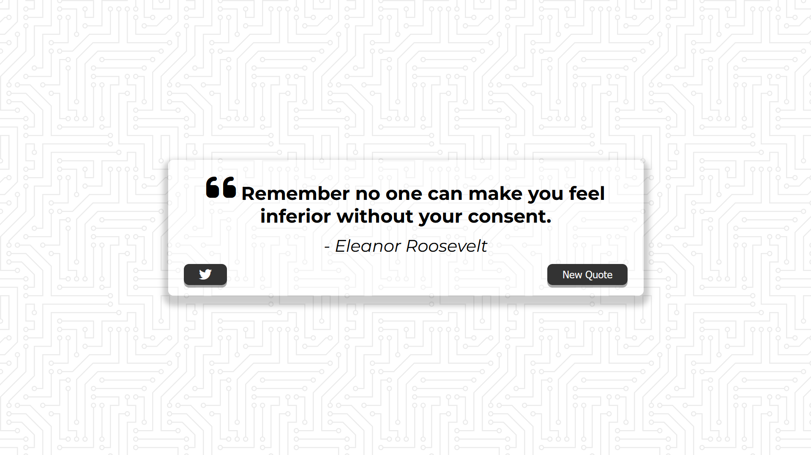

# Quote-Generator

A web-based application to display inspirational quotes fetched from an API. This project allows users to view random quotes and share them on Twitter.

## Features

- **Random Quote Generation**: Fetches a new quote on button click.
- **Twitter Integration**: Share quotes directly on Twitter with a single click.
- **Responsive Design**: Optimized for devices of all sizes.
- **Loading Animation**: Displays a loader while fetching data from the API.

## Project Structure

```
├── index.html   # Main HTML file
├── style.css    # Stylesheet for layout and styling
├── script.js    # JavaScript for dynamic functionality
```

## Technologies Used

- **HTML5**: Structure of the web application.
- **CSS3**: Styling and responsive design.
- **JavaScript (ES6)**: Logic for API integration and interactivity.
- **Font Awesome**: Icons for better visuals.

## How to Run Locally

1. Clone the repository:
   ```bash
   git clone <repository-url>
   ```
2. Navigate to the project directory:
   ```bash
   cd quote-generator
   ```
3. Open the `index.html` file in your web browser.

## API Used

- **Endpoint**: [https://quotes-api-self.vercel.app/quote](https://quotes-api-self.vercel.app/quote)
- Fetches a random quote in JSON format.

## Screenshot

- desktop view ------------------

   

- mobile view ------------------

   


## License

This project is licensed under the MIT License. Feel free to use and modify it as per your needs.
